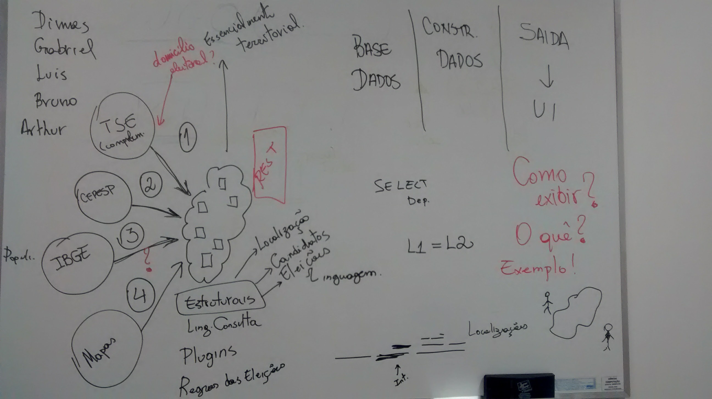
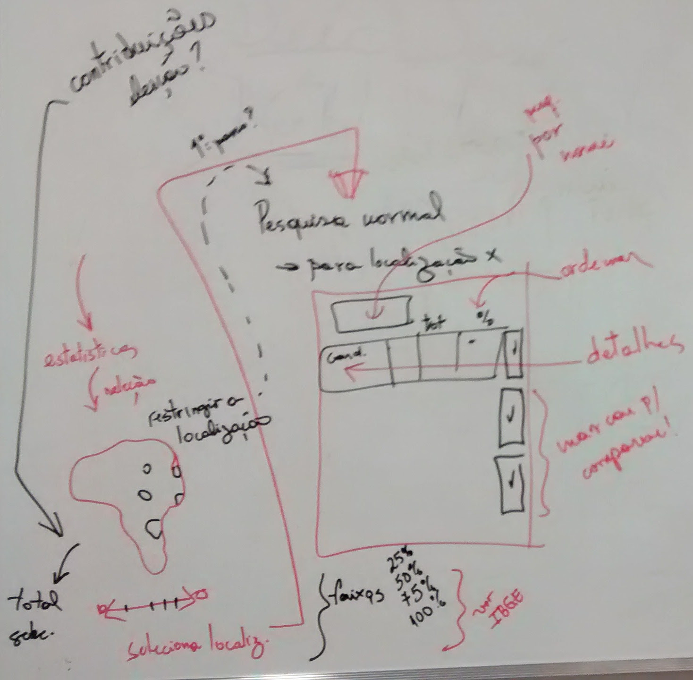

# Projeto da Implementação

## Resumo

Solução proverá pesquisas em resultados eleitorais baseadas em localização semântica estática (divisões administrativas) e dinâmica (territórios baseados em critérios sociais), o oferecerá um frontend composto de uma aplicação baseada em mapas que permitirá simulações e um backend que oferecerá as pesquisas utilizando uma api RESTful. Aplicação frontend ofererá ainda interface específica para eleitores.

## Solução

A solução deve ser composta de duas partes:

+ **Frontend**: uma interface web baseada em localização, fazendo uso, a priori do <http://leafletjs.com/> (usando base de mapas [openstreetmap](https://www.openstreetmap.org/)).
+ **Backend**: uma API RESTful para consultas baseadas em localização equivalentes (o máximo possível) às que podem ser realizadas com a interface do usuário. Essa interface é importante por permitir que a solução seja utilizada para pesquisas de fato, sem as limitações inerentes à interface gráfica.

Por consultas baseadas em localização entenda-se que as consultas do usuário levarão em conta localização como primeiro critério para o resultado, diferentemente da API CEPESP que dá pouca relevância a essa informação. Em particular, dois tipos de localização serão considerados:

* **Localização semântica estática**: referente às divisões administrativas especificadas pelo IBGE (macro, meso, microrregiões, estados, municípios), complementadas por possíveis subdivisões estabelecidas pelo TSE (zonas e seções).
* **Localização semântica dinâmica**: divisões do território brasileiro criadas dinamicamente a partir de consultas a dados sociais e políticos do IBGE como, por exemplo, *regiões com índice IDH > 0.65*, devidamente georeferenciados e associados às localizações estáticas.

A API deverá permitir consultas geográficas baseadas nessas localizações.

Rascunho produzido para discutir os aspectos da implementação. 

## Informações Produzidas pela Solução

As seguintes informações serão produzidas pela solução e oferecidas em ambas as interfaces:

* Candidatos eleitos
* Percentual dos eleitos por partido e coligação

... a completar.

## Interface 

